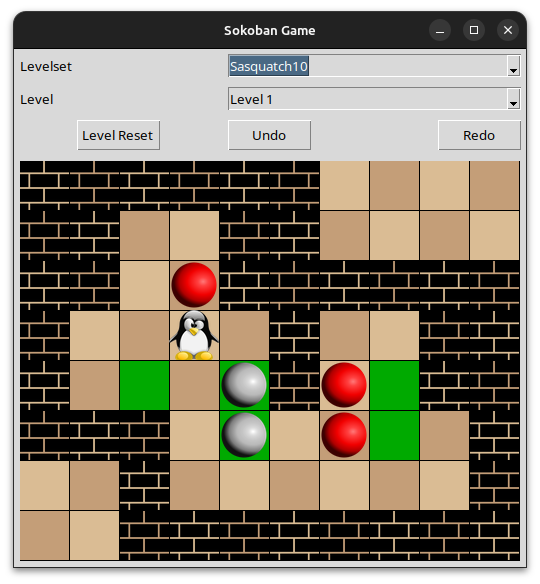

# Sokoban
## About
Work in progress implementation the puzzle game, Sokoban.

## How to play
* The objective is to push all of the red spheres onto the green squares.
* Select a level with the **Levelset** and **Level** dropdown menus.
* Move the player with the `WASD` keys. 
* `CTRL Z` for undo move, `CTRL Y` for redo move, 
* `CTRL -` for zoom out, `CTRL +` for zoom in.
* `CTRL N` for level reset.

## Features
* Perl to parse level data and store it via a `.json` data structure.
* Persitent level progress via a `.json` config file.
* Simple GUI in `Tkinter`.
* Over 1000 levels included from the Sasquatch and Microban levelsets

## Todo
* I plan to refactor all the core game logic using `PerlTK` as a learning exercise.
* Web version
* C++ SDL version with `wxWidgets` 
* AI solver in C++, Perl, or Python

## License 
MIT Standard License.

